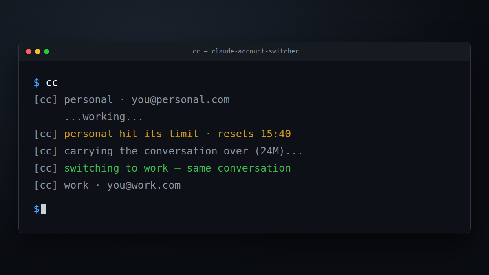

<div align="center">

# claude-account-switcher

**Use every Claude Code account you own. When one hits its limit, keep working on the next, in the same conversation.**

[](https://github.com/MarwanMaher0/claude-account-switcher/actions/workflows/ci.yml)
[](LICENSE)
[](#step-1-check-what-you-need)
[](CONTRIBUTING.md)
[](#privacy)

[Get started](#get-started) · [Everyday use](#everyday-use) · [VS Code](#step-6-vs-code-users-only) · [Troubleshooting](docs/TROUBLESHOOTING.md)

</div>

---

You are deep in a task and Claude Code stops: **you have hit your usage limit.**

Your other account, a work seat or a second plan, sits unused. Switching by hand means signing
out, signing back in, and losing the conversation. So you wait.

`cc` does the switch for you, and the conversation comes with it:

<div align="center">
  
</div>

## Is this for you?

- ✅ You have **two or more** Claude accounts, for example a personal plan and a work seat.
- ✅ You use Claude Code in a terminal, in the VS Code panel, or both.
- ❌ You have **one** account. This tool does not pool or share accounts, and it cannot raise
  any limit. Each account keeps its own limits.

---

## Get started

About five minutes. Steps 1 to 5 are for everyone. Step 6 is only for VS Code users.

### Step 1: Check what you need

```bash
claude --version
python3 --version
```

Both should print a version. You need Claude Code signed in to your first account, and Python
3.6 or newer. Any bash from 3.2 up works, including the one macOS ships.

If `claude` does not run, see [Troubleshooting](docs/TROUBLESHOOTING.md#claude-itself-will-not-start).

### Step 2: Install

```bash
git clone https://github.com/MarwanMaher0/claude-account-switcher.git
cd claude-account-switcher
./install.sh
```

This copies four commands (`cc`, `cc-detect`, `cc-watch`, `cc-vscode`) into `~/.local/bin`.
Nothing else on your machine changes.

If it prints `NOTE: ... is not on your PATH`, run the `export` line it shows, add that line to
your shell profile, and open a new terminal.

> [!NOTE]
> `cc` is also the usual name of the C compiler, and `install.sh` warns you if one exists. While
> this tool is installed, builds that run `cc` (such as `make`) may start the switcher instead.
> Check which one runs with `command -v cc`.

**Or install from Claude Code.** Add the plugin, then let it set itself up:

```bash
claude plugin marketplace add https://github.com/MarwanMaher0/claude-account-switcher
claude plugin install cc-switch
```

Start `claude` and type `/cc-setup`. It installs the same four commands and shows what to do
next. This also covers Step 6a for your first account.

### Step 3: See your first account

```bash
cc status
```

You should see the account you already use, marked `(default)`:

```
  ▶ personal  available      you@gmail.com      ~/.claude  (default)

  next launch -> personal
```

There is nothing to configure. `cc` finds that account on its own.

### Step 4: Add your other account

```bash
cc add work
```

`work` is a short name you choose: lowercase letters, numbers, `-` and `_`.

1. `cc add` asks for the **email of the account to add**. Type it and press Enter.
2. Your browser opens the claude.ai login page.
3. Sign in with that account. `cc add` finishes on its own and shows both accounts.

> [!IMPORTANT]
> Your browser signs in with **whichever claude.ai account is already open in it**. If that is
> your first account, open the login link in a **private window**, or sign out of claude.ai
> first. Otherwise `cc add` sees the same account twice, adds nothing, and tells you to try again.

Check that it worked:

```bash
cc status
```

You should now see two accounts, each with its own email. Have more accounts? Repeat this step
with another name.

### Step 5: Use `cc` instead of `claude`

```bash
cc
```

That is all. `cc` opens Claude Code on an account that still has quota.

When that account hits its limit, `cc` ends the session, moves to the next account, and reopens
**the same conversation**. It takes a few seconds, and you do not need to do anything.

### Step 6: VS Code users only

The Claude panel in VS Code starts Claude by itself, so `cc` cannot restart it for you. Two
things make the panel follow your accounts.

**6a. Install the plugin in every account.** The plugin notices a limit the moment it happens and
moves the panel. Plugins are installed per account, so do this once for each account.

For the account you already had:

```bash
claude plugin marketplace add https://github.com/MarwanMaher0/claude-account-switcher
claude plugin install cc-switch
```

For each account you added with `cc add` (replace `work` with its name):

```bash
CLAUDE_CONFIG_DIR=~/.claude-work claude plugin marketplace add https://github.com/MarwanMaher0/claude-account-switcher
CLAUDE_CONFIG_DIR=~/.claude-work claude plugin install cc-switch
```

> [!WARNING]
> Never put `CLAUDE_CONFIG_DIR=~/.claude` in front of a command for your **first** account.
> Claude Code then treats it as a brand-new install, and signing in can overwrite that
> account's login. For the first account, always use the plain `claude` commands.

**6b. Turn on panel sync:**

```bash
cc vscode on
```

You should see:

```
VS Code sync on · ~/.config/Code/User/settings.json
VS Code panel -> personal
```

It finds the settings for VS Code, VS Code Insiders, VSCodium and Cursor on Linux and macOS. If it
says no settings file was found, give the path yourself:

```bash
cc vscode on --settings "/path/to/User/settings.json"
```

**When the panel hits a limit:** your next message is not sent. Claude replies with which limit
ran out, when it resets, and asks you to reload. Open the command palette (`Ctrl+Shift+P`, or
`Cmd+Shift+P` on macOS) and run **Developer: Reload Window**. Your open chats come back on the next
account.

---

## Everyday use

| You want to | Run |
|---|---|
| Start Claude Code | `cc` |
| See every account, its limit and when it resets | `cc status` |
| Start on a particular account while it has quota | `cc use work` |
| Add another account | `cc add <name>` |
| Add one without the email question | `cc add <name> --email you@company.com` |
| Use one account for a single session only | `cc --acct work` |
| Keep a session open at a limit instead of switching | `cc --manual` |
| Forget a limit that `cc` recorded by mistake | `cc clear work` |
| Pass options straight to Claude Code | `cc -- <claude options>` |
| Stop managing the VS Code panel | `cc vscode off` |
| See all commands | `cc help` |

### Reading `cc status`

```
    personal  LIMITED · weekly until Mon 07:00 (1 d 7 h)   you@gmail.com     ~/.claude  (default)
  ▶ work      available                                   you@company.com   ~/.claude-work

  next launch -> work
```

- `▶` marks the account `cc` starts on next.
- `LIMITED · 5-hour` or `LIMITED · weekly` names the limit that ran out, and when it resets.
- A line starting with `!` warns that two names are signed in to the same account. They share
  one limit, so remove one of them.

## Remove an account

```bash
cc remove work            # stop using it; its folder stays on disk
cc remove work --purge    # also delete its folder (you type the name to confirm)
```

Your first account cannot be removed.

## Uninstall

From the folder you cloned:

```bash
cc vscode off        # only if you turned it on
./uninstall.sh
```

If you installed the plugin, remove it from each account the same way you added it:

```bash
claude plugin uninstall cc-switch                                   # first account
CLAUDE_CONFIG_DIR=~/.claude-work claude plugin uninstall cc-switch  # each added account
```

Your accounts and their logins stay. To remove everything, also delete `~/.claude-switch` and any
`~/.claude-<name>` folders that `cc add` created.

---

## Good to know

- **A running session cannot change accounts.** Claude Code reads the account once, when it starts.
  That is why `cc` restarts the session in the terminal, and why VS Code needs a window reload.
- **`cc` only switches sessions it started.** A plain `claude` does not switch, but its limits are
  still noticed, so the next `cc` skips that account.
- **claude.ai in your browser is separate.** This tool cannot move web chats or their limits.
- **It cannot use other AI subscriptions**, such as GitHub Copilot. Claude Code only talks to
  Anthropic.
- **When every account is used up**, `cc` tells you which one frees up first. You can also set up
  paid backups: see [Configuration](docs/CONFIG.md#fallbacks).

## Privacy

- No network calls and no telemetry.
- Never reads, copies or prints your login credentials.
- `cc add` copies only `settings.json` and `CLAUDE.md` into a new account.
- To carry a conversation across, chats are copied or hard-linked between your account folders,
  **on your own machine only**.
- `cc vscode on` changes one VS Code setting, `claudeCode.environmentVariables`, and first backs
  the file up to `~/.claude-switch/vscode-settings.backup.json`.

Details in [SECURITY.md](SECURITY.md).

## Try it without installing

```bash
bash test/demo.sh
```

Shows a real account switch using a fake Claude in a throwaway folder. No account is touched and no
quota is used.

## Documentation

| Read | When |
|---|---|
| [Troubleshooting](docs/TROUBLESHOOTING.md) | something did not work |
| [Configuration](docs/CONFIG.md) | changing account order, paid backups, advanced settings |
| [How it works](docs/HOW-IT-WORKS.md) | limit detection, the switch, the VS Code panel |
| [Contributing](CONTRIBUTING.md) | running the tests, making changes safely |

## Licence

MIT. See [LICENSE](LICENSE).
