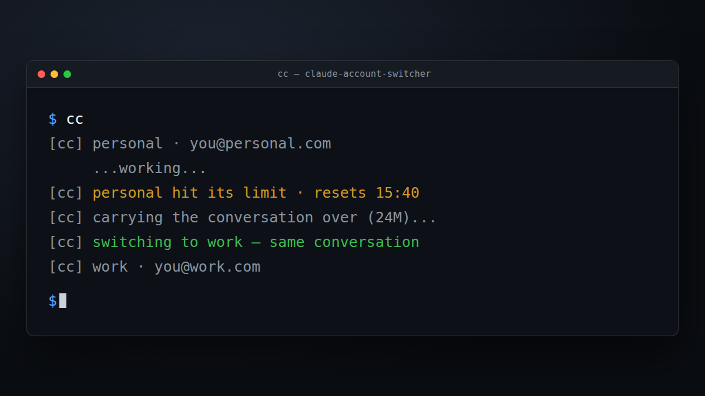

<div align="center">

# claude-account-switcher

**Use every Claude Code account you own. When one hits its limit, keep working on the next, in the same conversation.**

[](https://github.com/MarwanMaher0/claude-account-switcher/actions/workflows/ci.yml)
[](LICENSE)
[](#step-1-check-what-you-need)
[](CONTRIBUTING.md)
[](#privacy)

[Get started](#get-started) · [Everyday use](#everyday-use) · [Separate projects](#separate-projects-one-account-per-folder) · [VS Code](#step-6-vs-code-users-only) · [Troubleshooting](docs/TROUBLESHOOTING.md)

</div>

---

You are deep in a task and Claude Code stops: **you have hit your usage limit.**

Your other account, a work seat or a second plan, sits unused. Switching by hand means signing
out, signing back in, and losing the conversation. So you wait.

`cc` does the switch for you, and the conversation comes with it:

<div align="center">
  
</div>

## Is this for you?

- ✅ You have **two or more** Claude accounts, for example a personal plan and a work seat.
- ✅ You use Claude Code in a terminal, in the VS Code panel, or both.
- ✅ You work for more than one company and must keep each one's work on its own account
  (see [Separate projects](#separate-projects-one-account-per-folder)).
- ❌ You have **one** account. This tool does not pool or share accounts, and it cannot raise
  any limit. Each account keeps its own limits.

---

## Get started

About five minutes. Steps 1 to 5 are for everyone. Step 6 is only for VS Code users.

### Step 1: Check what you need

```bash
claude --version
python3 --version
```

Both should print a version. You need Claude Code signed in to your first account, and Python
3.6 or newer. Any bash from 3.2 up works, including the one macOS ships.

If `claude` does not run, see [Troubleshooting](docs/TROUBLESHOOTING.md#claude-itself-will-not-start).

### Step 2: Install

```bash
git clone https://github.com/MarwanMaher0/claude-account-switcher.git
cd claude-account-switcher
./install.sh
```

This copies five commands (`cc`, `cc-detect`, `cc-watch`, `cc-vscode`, `cc-claude-wrapper`) into
`~/.local/bin`, and the VS Code companion extension's two files into `~/.local/share/cc-switch`.
Nothing else on your machine changes.

If it prints `NOTE: ... is not on your PATH`, run the `export` line it shows, add that line to
your shell profile, and open a new terminal.

> [!NOTE]
> `cc` is also the usual name of the C compiler, and `install.sh` warns you if one exists. While
> this tool is installed, builds that run `cc` (such as `make`) may start the switcher instead.
> Check which one runs with `command -v cc`.

**Or install from Claude Code.** Add the plugin, then let it set itself up:

```bash
claude plugin marketplace add https://github.com/MarwanMaher0/claude-account-switcher
claude plugin install cc-switch
```

Start `claude` and type `/cc-setup`. It installs the same four commands and shows what to do
next. This also covers Step 6a for your first account.

### Step 3: See your first account

```bash
cc status
```

You should see the account you already use, marked `(default)`:

```
  ▶ personal  available      you@gmail.com      ~/.claude  (default)

  next launch -> personal
```

There is nothing to configure. `cc` finds that account on its own.

### Step 4: Add your other account

```bash
cc add work
```

`work` is a short name you choose: lowercase letters, numbers, `-` and `_`.

1. `cc add` asks for the **email of the account to add**. Type it and press Enter.
2. Your browser opens the claude.ai login page.
3. Sign in with that account. `cc add` finishes on its own and shows both accounts.

> [!IMPORTANT]
> Your browser signs in with **whichever claude.ai account is already open in it**. If that is
> your first account, open the login link in a **private window**, or sign out of claude.ai
> first. Otherwise `cc add` sees the same account twice, adds nothing, and tells you to try again.

Check that it worked:

```bash
cc status
```

You should now see two accounts, each with its own email. Have more accounts? Repeat this step
with another name.

### Step 5: Use `cc` instead of `claude`

```bash
cc
```

That is all. `cc` opens Claude Code on an account that still has quota.

When that account hits its limit, `cc` ends the session, moves to the next account, and reopens
**the same conversation**. It takes a few seconds, and you do not need to do anything.

### Step 6: VS Code users only

The Claude panel in VS Code starts Claude by itself, so `cc` cannot restart it for you. Two
things make each VS Code window follow your accounts.

**6a. Install the plugin in every account.** The plugin notices a limit the moment it happens and
records it, which is what moves your windows. Plugins are installed per account, so do this once for each account.

For the account you already had:

```bash
claude plugin marketplace add https://github.com/MarwanMaher0/claude-account-switcher
claude plugin install cc-switch
```

For each account you added with `cc add` (replace `work` with its name):

```bash
CLAUDE_CONFIG_DIR=~/.claude-work claude plugin marketplace add https://github.com/MarwanMaher0/claude-account-switcher
CLAUDE_CONFIG_DIR=~/.claude-work claude plugin install cc-switch
```

> [!WARNING]
> Never put `CLAUDE_CONFIG_DIR=~/.claude` in front of a command for your **first** account.
> Claude Code then treats it as a brand-new install, and signing in can overwrite that
> account's login. For the first account, always use the plain `claude` commands.

**6b. Bind your VS Code windows:**

```bash
cc vscode on
```

You should see:

```
VS Code: each window now runs Claude on its folder's account · ~/.config/Code/User/settings.json
  wrapper    ~/.local/bin/cc-claude-wrapper
  companion  cc-switch.cc-switch-binding installed with code
  Open windows re-check within a few seconds. A chat already running stays where it is.
```

This does two things, and changes VS Code settings only after the first one worked:

1. It builds a small companion extension, **cc-switch window binding**, and installs it with
   VS Code's `code` command (also `code-insiders`, `codium`, the snap and the macOS app). In each
   window it points the Claude panel's history at the account that window runs on, re-checks
   when a limit is recorded, and shows the account in the status bar: `Claude: acme`.
2. It sets one **user** setting, `claudeCode.claudeProcessWrapper`, to `cc-claude-wrapper`. The
   Claude extension then starts every Claude process through it, and the wrapper picks the
   account for that window's folder, the same way `cc` does in a terminal. It also removes the
   `CLAUDE_CONFIG_DIR` entry an older `cc` put into `claudeCode.environmentVariables`, after a
   backup to `~/.claude-switch/vscode-settings.backup.json`.

It finds the settings for VS Code, VS Code Insiders, VSCodium and Cursor on Linux and macOS. If it
says no settings file was found, give the path yourself:

```bash
cc vscode on --settings "/path/to/User/settings.json"
```

If no `code` command is found, nothing is changed and it prints the path of the `.vsix` to
install by hand (**Extensions: Install from VSIX…**); run `cc vscode on` again afterwards.
`cc vscode on --wrapper-only` skips the companion: chats still follow your pins, but the history
list may show another account's chats.

**When the panel hits a limit:** your next message is not sent. Claude replies with which limit
ran out and when it resets. Within a second the window moves: **new chats** start on the next
allowed account, and a notification says so. The chat that hit the limit stays on its account;
start a new chat, or close its tab and then reopen it from the history list (its transcript was
carried over), to go on. Picking a chat whose tab is still open only brings that tab back, on the
old account. When the limit resets, the window moves back by itself. New chats, the history list
and resume follow the move at once; the panel's own account label and login status can show the
old account until **Developer: Reload Window**.

**Upgrading from 2.2 or earlier?** Run `cc vscode migrate`. It shows (and changes nothing) what
older versions left behind: `CLAUDE_CONFIG_DIR` entries in pinned folders' `.vscode/settings.json`,
which VS Code never read, and pinned folders' chats that landed in the wrong account because of
it. `cc vscode migrate --apply` cleans them up; `cc vscode migrate --undo` reverts that.

## Separate projects: one account per folder

If you work for more than one company, each company's folders can stay on that company's
account, while everything else runs on your own. Run this inside a project folder:

```bash
cd ~/work/acme
cc pin
```

```
Folder: ~/work/acme   (all subfolders included)

Which account should this folder use?  (↑/↓, Enter)
  ▶ acme       you@acme.example
    globex     you@globex.example
    personal   you@gmail.com
    + Add a new account

If acme hits its limit:  (↑/↓, Enter)
  ▶ Switch to personal
    Stop and wait for reset
    Ask me each time

Apply to:  (↑/↓, Enter)
  ▶ Terminal and VS Code
    Terminal only

Save? (Y/n)
```

From then on, every `cc` started in that folder or any subfolder uses `acme`. It does not
matter which account is "next" anywhere else.

**The rules a pin enforces:**

- A company account never falls back to another company's account. The only fallback a pin can
  name is an account that is not pinned anywhere, normally your own default account.
- A pinned account is kept for its folders. Outside them, `cc` never picks it, so personal work
  never uses a company seat.
- Each session follows its own folder. An `acme` limit only affects `acme` sessions. A `globex`
  window keeps working until `globex` itself runs out.
- With no pins, nothing changes: `cc` rotates over your accounts as before.
- `cc --acct <name>` still overrides the pin for one session.

**If a company account hits its limit**, the pin decides:

| You chose | What happens |
|---|---|
| Switch to personal | The session moves to `personal` and the conversation comes with it |
| Stop and wait for reset | `cc` stops and shows when the account resets |
| Ask me each time | The terminal asks you. In VS Code, a notification offers **Use personal** or **Stay** |

> [!NOTE]
> Falling back to `personal` copies that chat into your personal account's folder **on this
> machine**, so the conversation can continue there. Nothing leaves your computer, but if a
> company's rules forbid even that, choose **Stop and wait for reset**.

Scripts can skip the menu:

```bash
cc pin ~/work/acme --account acme --fallback personal      # or: none, ask
cc pin ~/work/globex --account globex --fallback none --no-vscode
cc pins                                                    # list pins
cc unpin ~/work/acme                                       # remove one
```

`cc status` also lists your pinned folders, and which account the current folder runs on.

### VS Code with pinned folders

With **Terminal and VS Code** and `cc vscode on`, every VS Code window on a pinned folder runs
Claude on that folder's account, so several windows can run at once, each on a different
account. Windows that are already open re-check by themselves: new chats, the history list and
resume follow without a reload (only the panel's own account label and login status may lag until
**Developer: Reload Window**). `cc pin`
writes nothing into the folder: VS Code only reads the Claude extension's account settings from
your **user** settings (they are machine-scoped), which is why older versions' per-folder
`.vscode/settings.json` entries never worked.

**A folder's chats follow its pin.** Claude Code keeps each chat in the account it ran on, so a
folder you pin after using it has its earlier chats elsewhere: in your default account, or in
another company's. `cc pin` links them into the pin's account (hard links: nothing is moved,
deleted or overwritten), and so do `cc vscode on`, each VS Code window before it is bound, and a
resume. Your history list and open tabs keep working. A chat of another pinned folder never
travels, and neither do chats an account holds because this folder was pinned to it before:
re-pinning a folder from `acme` to `globex` leaves acme's chats with acme. On an install
upgraded from 2.2, whose earlier re-pins cc never recorded, only the default account's chats
come by themselves; for the rest the VS Code window offers **Bring N from &lt;account&gt;** (or run
`cc adopt --from <account>`), which is then remembered for that pin.

```bash
cc adopt --dry-run          # what would be brought into this folder's account
cc adopt ~/work/acme        # do it by hand (it normally runs by itself)
cc adopt --from acme        # also bring the chats a former (or possible former) pin's account holds
```

- **If cc cannot decide** the account for a pinned folder (a broken pin, a missing `cc-detect`),
  Claude does not start in that window, rather than run on the wrong account. The error says to
  run `cc status`; the status bar shows `Claude: ? (cc-switch error)`. In an unpinned folder
  Claude then runs on the default account.
- **Claude in a terminal** (`claudeCode.useTerminal`) does not use the process wrapper. In that
  mode the companion puts cc's `claude` shim first on the window's terminal `PATH`, so terminal
  Claude goes through the wrapper too and fails closed the same way. A shell startup file that
  puts another `claude` ahead of it on `PATH` (or an alias) bypasses this; check with
  `type claude` in that terminal.
- **A workspace with several folders** runs on its first folder's account, as the Claude
  extension does. If the folders are pinned to different accounts, the window warns you and the
  status bar shows `Claude: mixed pins (using acme)`. Open them in separate windows instead.
- **Remote windows** (SSH, WSL, containers) are not bound.

`cc status` lists the open VS Code windows and the account each one is on.

### Never pause: the terminal versus the VS Code panel

- **In a terminal**, `cc` owns the process. When an account runs out, `cc` closes the session,
  reopens the same conversation on the allowed account, and sends **"Continue where you left
  off."** for you. Nobody needs to type anything. This works for every terminal at once: five
  tabs on one account each switch on their own. Change the message, or turn it off, in the
  [config](docs/CONFIG.md#auto-continue), or with `cc --no-auto-continue`.
- **In the VS Code panel**, VS Code starts Claude itself, so `cc` cannot restart it or type into
  it. After a switch, new chats start on the next account, but each open chat waits for you.

So when you need work to continue without you, run your sessions with `cc` in **VS Code's
integrated terminal** rather than in the Claude panel.

### Switching before the limit (optional)

`cc` can switch at **98%** of a limit instead of at 100%, between turns, so a session never hits
the wall mid-task. Claude Code already shows this usage to status line commands; `cc` reads it
from there. It makes **no network call** of its own. It only works on Pro and Max plans, where
Claude Code reports usage. It is off by default. See
[Switching before the limit](docs/CONFIG.md#switching-before-the-limit).

---

## Everyday use

| You want to | Run |
|---|---|
| Start Claude Code | `cc` |
| See every account, its limit and when it resets | `cc status` |
| Start on a particular account while it has quota | `cc use work` |
| Add another account | `cc add <name>` |
| Add one without the email question | `cc add <name> --email you@company.com` |
| Use one account for a single session only | `cc --acct work` |
| Keep a session open at a limit instead of switching | `cc --manual` |
| Forget a limit that `cc` recorded by mistake | `cc clear work` |
| Pass options straight to Claude Code | `cc -- <claude options>` |
| Stop binding VS Code windows | `cc vscode off` |
| Clean up after upgrading from 2.2 | `cc vscode migrate` (then `--apply`) |
| Keep a folder on one account | `cc pin` (inside the folder) |
| List or remove pinned folders | `cc pins`, `cc unpin` |
| Bring a pinned folder's older chats into its account | `cc adopt` (runs by itself on `cc pin`) |
| After a switch, wait for me instead of carrying on | `cc --no-auto-continue` |
| See all commands | `cc help` |

### Reading `cc status`

```
    personal  LIMITED · weekly until Mon 07:00 (1 d 7 h)   you@gmail.com     ~/.claude  (default)
  ▶ work      available                                   you@company.com   ~/.claude-work

  next launch -> work
```

- `▶` marks the account `cc` starts on next.
- `LIMITED · 5-hour` or `LIMITED · weekly` names the limit that ran out, and when it resets.
- A line starting with `!` warns that two names are signed in to the same account. They share
  one limit, so remove one of them.

## Remove an account

Unpin any folder that uses the account first (`cc pins` lists them).

```bash
cc remove work            # stop using it; its folder stays on disk
cc remove work --purge    # also delete its folder (you type the name to confirm)
```

Your first account cannot be removed.

## Uninstall

From the folder you cloned:

```bash
cc unpin <folder>    # for each pinned folder (cc pins lists them)
./uninstall.sh       # also runs cc vscode off: removes the wrapper setting and the companion
```

If you installed the plugin, remove it from each account the same way you added it:

```bash
claude plugin uninstall cc-switch                                   # first account
CLAUDE_CONFIG_DIR=~/.claude-work claude plugin uninstall cc-switch  # each added account
```

Your accounts and their logins stay. To remove everything, also delete `~/.claude-switch` and any
`~/.claude-<name>` folders that `cc add` created.

---

## Good to know

- **A running session cannot change accounts.** Claude Code reads the account once, when it starts.
  That is why `cc` restarts the session in the terminal, and why in VS Code only new chats move.
- **`cc` only switches sessions it started.** A plain `claude` does not switch, but its limits are
  still noticed, so the next `cc` skips that account.
- **claude.ai in your browser is separate.** This tool cannot move web chats or their limits.
- **It cannot use other AI subscriptions**, such as GitHub Copilot. Claude Code only talks to
  Anthropic.
- **When every account is used up**, `cc` tells you which one frees up first. You can also set up
  paid backups: see [Configuration](docs/CONFIG.md#fallbacks).

## Privacy

- No network calls and no telemetry.
- Never reads, copies or prints your login credentials.
- `cc add` copies only `settings.json` and `CLAUDE.md` into a new account.
- To carry a conversation across, chats are copied or hard-linked between your account folders,
  **on your own machine only**.
- `cc vscode on` sets one VS Code user setting, `claudeCode.claudeProcessWrapper`, removes its own
  `CLAUDE_CONFIG_DIR` entry from `claudeCode.environmentVariables`, and first backs the file up
  to `~/.claude-switch/vscode-settings.backup.json`. The companion extension it installs is built
  on your machine from two files in this repository, has no dependencies and makes no network
  call.
- `cc pin` writes nothing into your folders.
- Falling back from a company account to `personal` copies that chat into the personal account's
  folder, on this machine only.
- The optional early switch reads the usage Claude Code already passes to status line commands.
  It adds no network call.

Details in [SECURITY.md](SECURITY.md).

## Try it without installing

```bash
bash test/demo.sh
```

Shows a real account switch using a fake Claude in a throwaway folder. No account is touched and no
quota is used.

## Documentation

| Read | When |
|---|---|
| [Troubleshooting](docs/TROUBLESHOOTING.md) | something did not work |
| [Configuration](docs/CONFIG.md) | changing account order, paid backups, advanced settings |
| [How it works](docs/HOW-IT-WORKS.md) | limit detection, the switch, the VS Code panel |
| [Contributing](CONTRIBUTING.md) | running the tests, making changes safely |

## Licence

MIT. See [LICENSE](LICENSE).
